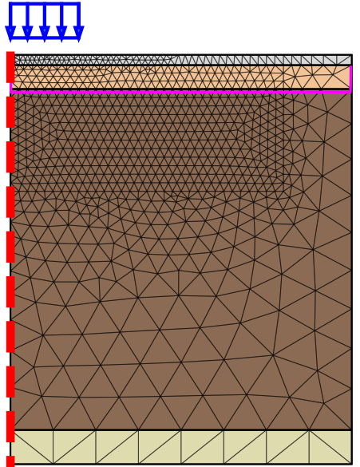

# Clay Under Load – A Visual Introduction to Undrained, Consolidation, and Safety Phases

This page presents a simplified numerical model designed to illustrate how saturated soft clay responds to surface loading through three common phases in geotechnical analysis:

- **Undrained plastic**
- **Consolidation**
- **Safety**

The goal is to help students and professionals develop visual intuition on pore pressure generation, stress redistribution, and long-term stability under staged loading.

---

<h2>🧩 Software</h2>

  

    

      The numerical model and animations were developed using 
      <a href="https://www.plaxis.com/" target="_blank"><strong>PLAXIS</strong></a>, a finite element software for geotechnical analysis. PLAXIS is widely used in both industry and academia to simulate soil-structure interaction, consolidation, and advanced constitutive behavior.
    

    

      The videos shown in this project were generated using the <strong>Python API</strong> provided by PLAXIS, which allows full automation of model creation, phase management, and result extraction.
    

  

  

    
  

---

<h2>🧱 Model Overview</h2>

  

    

      This 2D plain strain model represents a <strong>6-meter thick saturated clay layer</strong> loaded at the surface in three steps. The clay is <strong>normally consolidated</strong>, with <code>NSPT ≈ 1</code>, representing a very soft deposit like those found in the Amazon region.
    

    <ul>
      <li><strong>HS-Small</strong> material model, calibrated with triaxial and oedometer tests.</li>
      <li>Refined triangular mesh near the load area.</li>
      <li>Used to <strong>visualize soil response</strong> under staged loading.</li>
    </ul>
  

  

    
  

---

## 🟠 Undrained Plastic Stage

The first load increment is applied quickly, and the soil does not have time to drain. This causes:

- An **instant increase in pore pressure**
- **Plastic displacements** under the load
- **Effective stress drop**
- Changes in **stress orientation** and **shear zones**

**Pore Pressure Animation:**

  <video autoplay muted loop playsinline controls style="width: 100%; max-width: 100%;">
    <source src="assets/LoadEng.mp4" type="video/mp4">
  </video>

**Undrained Displacement Animation:**

  <video autoplay muted loop playsinline controls style="width: 100%; max-width: 100%;">
    <source src="assets/LoadMC_1_Eng.mp4" type="video/mp4">
  </video>

**Mohr Circles – Point A and B:**

- At **Point A** (beneath the load), pore pressure increases while total stress moves rightward, keeping effective stress nearly constant.
- At **Point B** (next to the load), stress directions rotate and both total and effective stress states evolve.

  <video autoplay muted loop playsinline controls style="width: 100%; max-width: 100%;">
    <source src="assets/LoadMC_2_Eng.mp4" type="video/mp4">
  </video>

---

## 🔵 Consolidation Stage

After the undrained stage, the system is allowed to drain for a fixed period. During this time:

- **Pore pressures dissipate** gradually
- **Effective stresses increase**
- **Settlement continues** as volume change occurs
- The system transitions to a drained state

**Pore Pressure Dissipation Animation:**

  <video autoplay muted loop playsinline controls style="width: 100%; max-width: 100%;">
    <source src="assets/Cons2_Eng.mp4" type="video/mp4">
  </video>

**Mohr Circles During Consolidation:**

- Effective stress grows as water drains.
- At the end of this stage, total and effective stresses converge (pore pressure = 0).

  <video autoplay muted loop playsinline controls style="width: 100%; max-width: 100%;">
    <source src="assets/ConsMC_1_Eng.mp4" type="video/mp4">
  </video>

---

## 🟢 Safety Stage

After full consolidation, the model is tested for stability using the **strength reduction method** (SSR). In this stage:

- No excess pore pressure remains
- The **failure mechanism** becomes visible
- The **Factor of Safety (FoS)** is estimated by progressively reducing the strength parameters until collapse

**Failure Mechanism Animation:**

  <video autoplay muted loop playsinline controls style="width: 100%; max-width: 100%;">
    <source src="assets/SSR.mp4" type="video/mp4">
  </video>

---

## 📌 Summary

This simplified example demonstrates how numerical models can be used not only to simulate real scenarios, but also to **gain intuition** about soil behavior under staged loading.

Numerical tools like PLAXIS, combined with scripting through Python, enable fast exploration of multiple scenarios and help us make better geotechnical decisions.

---

<h2>📚 About This Project</h2>

  

    
    
      You can access the code and files in the
      <a href="https://github.com/ntasso/plaxis-animations" target="_blank">GitHub repository</a>.
    
  

  

    
    
      These animations were originally prepared for a technical talk at the <strong>V CIGEMIS – Congreso Iberoamericano de Geotecnia y Métodos Numéricos</strong>, organized by
      <a href="https://sites.google.com/view/geogroup-uba/" target="_blank">GeoGroup</a>.
    
  

  

    
    <a href="https://www.linkedin.com/in/ntasso" target="_blank">Connect with me on LinkedIn</a>
  

  

    
    
      They are also used as part of the course <strong>Geotecnia Numérica I</strong>, which belongs to the
      <a href="https://www.fi.uba.ar/posgrado/carreras-de-especializacion/ingenieria-geotecnica" target="_blank">Specialization in Geotechnical Engineering</a> at the University of Buenos Aires (UBA).
    
  

